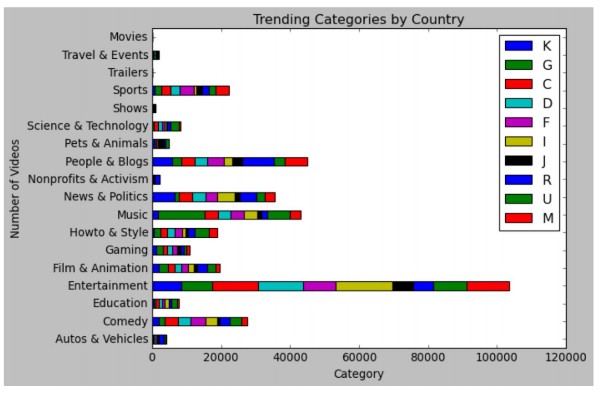
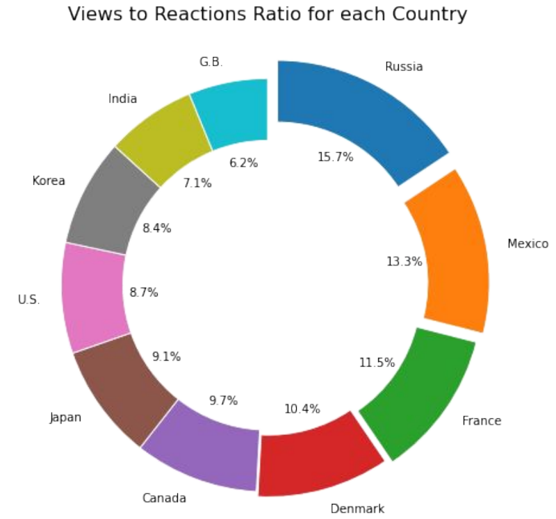
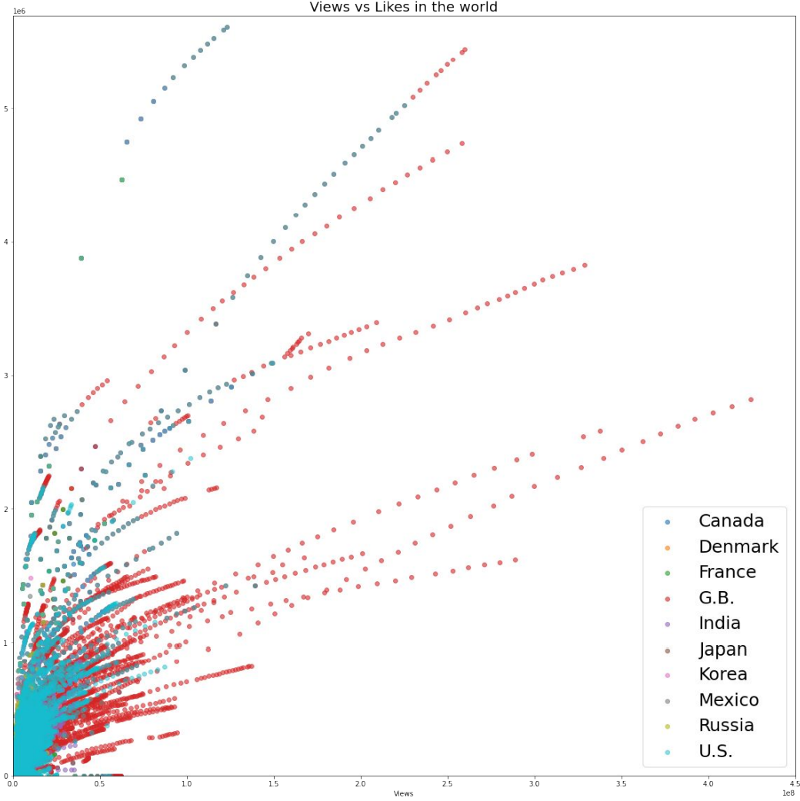
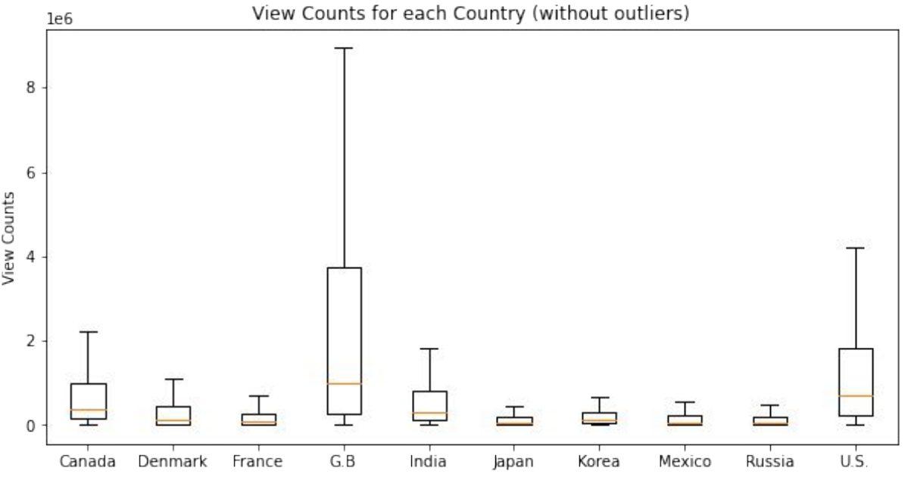

# Analyzing Worldwide Youtube Trends 
We analyzed Youtube trending video statistics data from 11.14.17 to 06.14.18. Our team looked at what categories of videos are most popular in the 10 most active countries for Youtube users. We then examined how viewers in different countries interact with content differently (likes, dislikes, comments, etc...)

## Our Process
* We tried to answer the following questions while conducting our data analysis: 
    + Are there trends within different countries? If so, what are the types of trending categories?
    + Is it possible to predict future viewer values on future videos based on the data we have now? 
    + Is there any correlation between trending videos and negative reactions? How does the number of dislikes relate to trending videos?
	+ Are videos removed due to the number of dislikes? what about the videos that have comments blocked?
    + Is there a distribution of attributes pattern for trending video views, comments, and likes?

## Visualizations 
* To see our full report and more visualizations, please see the powerpoint!

### Trending Categories by Country 

### Views to Reactions by Country

### Views vs. Likes

### View Count by Country 

### Team Members
    [Max Izotov](https://github.com/maximizo)
    - Mark Gu (https://github.com/markgu713)
    - Samuel Okunola (https://github.com/samuelokunola326)
    - JD Kwak (https://github.com/jdkwak1994)
    - Sabikha Khatun (https://github.com/Sabikha20)

## Resources:
All json and csv files are provided from the link below:
https://www.kaggle.com/datasnaek/youtube-new?select=USvideos.csv